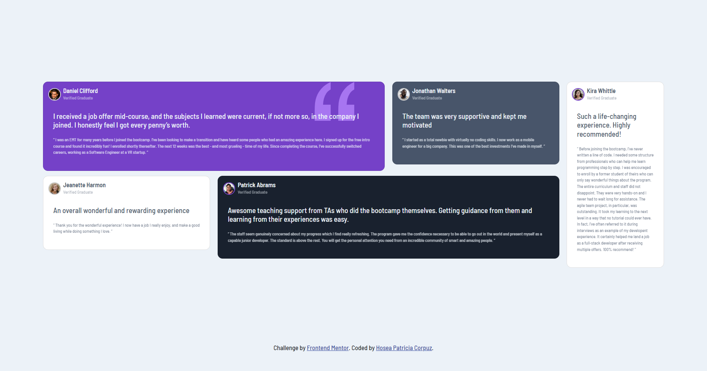
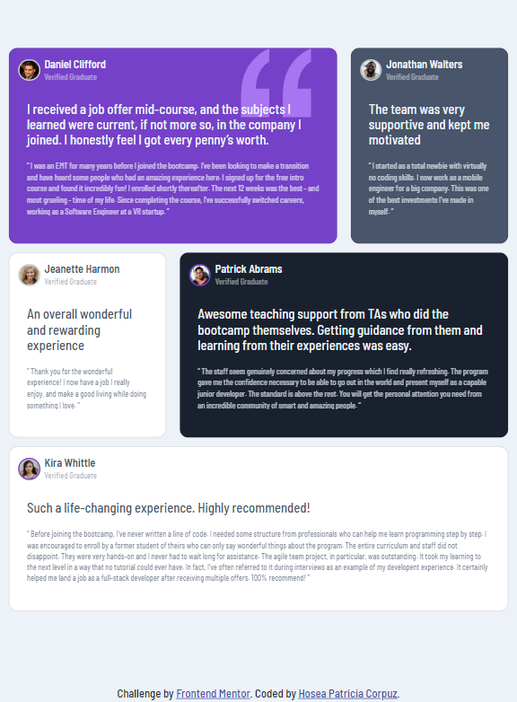
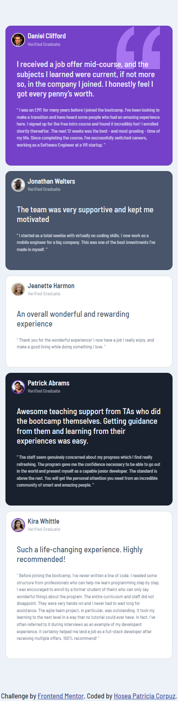

# Frontend Mentor - Testimonials grid section

## Screenshot

### Desktop

    

### Tablet

    

### Mobile

    

### Built with
- Bootstrap 5
- CSS
- HTML

### The challenge

Your users should be able to:

- View the optimal layout for the site depending on their device's screen size
